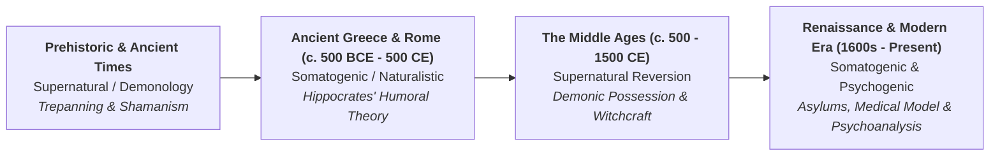
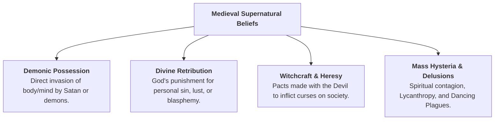

#Education #MentalHealth #OCR #Psychology #PsychologyComp2 #HistoricContext #HumoralTheory #SupernaturalExplanations

## Historical Views of Mental Illness: Hippocratic Humoral Theory & Middle Ages Supernatural Explanations

In **OCR A-Level Psychology (Component 2 / 3: Issues in Mental Health)**, understanding the historical context of mental illness illustrates how societies have conceptualized, classified, and treated psychological abnormality before the rise of the modern **[[1 - The Medical Model|Medical Model]]**.

---

### Chronological Paradigm Overview

The conceptualization of abnormal behavior has shifted across three major historical paradigms:

*   **Somatogenic Approach:**
    *   Assumes abnormal behavior results from physical, biological, or bodily dysfunction.
    *   *Examples:* Hippocrates' bodily humours; modern genetics and neurochemistry.

*   **Supernatural Approach:**
    *   Assumes abnormal behavior is caused by external, otherworldly forces.
    *   *Examples:* Demonic possession, divine wrath for sin, witchcraft, or astrological curses.

*   **Psychogenic Approach:**
    *   Assumes abnormal behavior stems from psychological, emotional, or cognitive distress and trauma.
    *   *Examples:* Freudian psychoanalysis, cognitive distortions, behavioural conditioning (developed later in the 19th & 20th centuries).

---

###  Ancient Greek Somatogenic Approach: Hippocrates' Humoral Theory

####  Background & Core Assumptions

*   **Hippocrates (c. 460 – c. 370 BCE):**
    *   Often designated the *"Father of Medicine."*
    *   Challenged the prevailing mystical beliefs of his era (e.g., that diseases were direct curses from gods such as Apollo).

*   **Naturalistic & Somatogenic Foundation:**
    *   Asserted that mental disorders were physical diseases of the **[[Brain]]** and body.
    *   Argued that psychopathology shares the exact same biological basis as physical illness.

*   **Brain as the Seat of Consciousness:**
    *   Hippocrates recognized that emotions, intellect, grief, joy, and madness originated within the brain, rather than the heart or supernatural spirits.

*   **The Sacred Disease (Epilepsy):**
    *   In his treatise *On the Sacred Disease*, Hippocrates explicitly refuted that epilepsy was divine or sacred.
    *   He argued it was caused by a physical blockage and humoral disruption within the brain.

#### The Four Humours (Humoral Theory)

Hippocrates (and later the Roman physician **Galen**, 129–216 CE) proposed that mental and physical health relied upon the balance of **four primary bodily fluids (humours)**:

| Humour | Element | Primary Organ | Qualities / Temperature | Associated Disorder / Temperament | Symptoms & Manifestation |
| :--- | :--- | :--- | :--- | :--- | :--- |
| **Black Bile** (*Melaina Chole*) | Earth | **Spleen** / Gallbladder | Cold & Dry | **Melancholia** (Melancholic temperament) | Deep despondency, severe depression, persistent sadness, introversion, loss of appetite, insomnia, and suicidal thoughts. |
| **Yellow Bile** (*Chole*) | Fire | **Liver** | Hot & Dry | **Mania** & **Phrenitis** (Choleric temperament) | Severe agitation, manic excitement, sudden outbursts of violent rage, irritable temper, brain fever, and delirium. |
| **Phlegm** (*Phlegma*) | Water | **Brain** / Lungs | Cold & Moist | **Phlegmatic** state | Lethargy, extreme apathy, sluggishness, emotional dullness, unresponsiveness, and cognitive slowing. |
| **Blood** (*Haima*) | Air | **Heart** | Hot & Moist | **Sanguine** state | Erratic mood swings, hyperactivity, over-excitability, impulsive euphoria, and excessive cheerfulness. |

*   **Eucrasia:**
    *   The state of healthy equilibrium and harmonious balance among all four humours.

*   **Dyscrasia:**
    *   An imbalance, excess, or deficiency of one or more humours, resulting in physical disease or mental abnormality.

#### Classifications of Mental Disorders by Hippocrates

Hippocrates categorized abnormal psychological conditions into three distinct diagnostic types:

1.  **Melancholia:**
    *   Characterised by chronic depression, severe sadness, and anxiety.
    *   Attributed to an overproduction and buildup of toxic **black bile**.

2.  **Mania:**
    *   Characterised by frenzy, boundless energy, agitation, and hallucinatory states.
    *   Attributed to excessive heat and boiling **yellow bile**.

3.  **Phrenitis (Brain Fever):**
    *   Characterised by acute fever, intellectual confusion, and delirium.
    *   Caused by inflammation in the brain driven by humoral disturbance.

####  Prescribed Humoral Treatments

Because mental illness was viewed as an organic bodily imbalance, treatments aimed to restore **humoral equilibrium**:

*   **Bloodletting (Phlebotomy):**
    *   Opening a vein or applying leeches to drain excess blood.
    *   Used especially to calm agitated or manic patients.

*   **Purging & Emetics:**
    *   Administering strong laxatives or induced vomiting.
    *   Used bitter medicinal herbs (e.g., **black hellebore**) to evacuate accumulated black or yellow bile through the digestive tract.

*   **Dietary Interventions & Fasting:**
    *   Prescribing cooling foods to counter "hot" conditions (mania).
    *   Prescribing warming foods to counter "cold" states (melancholia).

*   **Hydrotherapy:**
    *   Warm or cold baths to regulate bodily temperature and restore proper fluid circulation.

*   **Lifestyle & Environmental Regimen:**
    *   Prescribing exercise, physical rest, sexual moderation, fresh air, and peaceful surroundings to stabilize biological fluids.

#### Evaluation of Hippocrates' Humoral Theory

| Strengths | Weaknesses |
| :--- | :--- |
| **Pioneered the Medical Model:** Established the foundational principle that psychopathology is rooted in biological pathology rather than moral guilt or demonic intervention. | **Scientifically Inaccurate:** The four humours do not exist as regulatory neurobiological systems; fluid mechanics do not account for mental illness. |
| **Compassionate & Humane Care:** Removed moral condemnation and social blame from the afflicted, treating them as sick patients requiring clinical care. | **Harmful Physical Treatments:** Practices like excessive **bloodletting**, drastic purging, and toxic emetics frequently caused severe dehydration, infection, and physical death. |
| **Holistic Somatogenic Framework:** Recognized the mind-body connection, acknowledging the impact of diet, sleep, exercise, and physical health on emotional wellbeing. | **Ignored Psychosocial Factors:** Completely disregarded cognitive patterns, interpersonal relationships, family trauma, and environmental conditioning. |
| **Precursor to Neurochemistry:** Directly foreshadowed modern biological theories regarding **[[Neurotransmitters]]** (e.g., comparing black bile deficiency/excess to **Serotonin** / **[[Dopamine]]** dysregulation). | **Overly Simplistic Typology:** Attempted to reduce the vast complexity of human personality and affective disorders into four rigid bodily fluids. |

---

###  Middle Ages: Supernatural Explanations of Mental Illness

#### A. Historical Context & Paradigm Shift

*   **The Medieval Era (c. 500 – 1500 CE):**
    *   Following the fall of the Western Roman Empire, scientific advances of the Greco-Roman period were largely abandoned in Western Europe.

*   **Dominance of the Church:**
    *   The Roman Catholic Church became the supreme social, political, and philosophical authority.
    *   All human phenomena—especially abnormal behavior—were interpreted through theological, moral, and spiritual doctrines.

*   **Reversion to Demonology:**
    *   Naturalistic explanations were discarded.
    *   Mental disorder was re-conceptualized as a supernatural battlefield between **God and Satan** for the possession of the human soul.

#### Core Supernatural Explanations

1.  **Demonic Possession:**
    *   Unusual behaviors, psychotic delusions, auditory hallucinations, catatonia, and epileptic fits were seen as direct evidence of demonic invasion.
    *   The individual was viewed as either actively opening themselves to Satan through weakness of faith, or serving as a battlefield for spiritual warfare.

2.  **Divine Retribution (Punishment for Sin):**
    *   Madness was frequently explained as God's righteous wrath for moral decay, blasphemy, pride, lust, or lack of faith.
    *   The afflicted person was considered personally responsible and morally culpable, causing severe social ostracism and shame.

3.  **Witchcraft and the *Malleus Maleficarum* (1486):**
    *   During the late medieval period, bizarre behavior was linked directly to witchcraft and heresy.
    *   Individuals displaying erratic behaviors, hallucinations, or social non-conformity (predominantly eccentric elderly women or individuals with schizophrenia) were accused of making pacts with the Devil.
    *   **Malleus Maleficarum (*The Hammer of Witches*):**
        *   Published in 1486 by Catholic inquisitors **Heinrich Kramer** and **Jacob Sprenger**.
        *   Became the definitive guide for identifying, prosecuting, torturing, and executing suspected witches.
        *   Explicitly declared that mental derangement and strange delusions were products of demonic witchcraft.

4.  **Mass Madness & Epidemic Hysteria:**
    *   **Tarantism (St. Vitus' Dance):** Mass dance manias where large groups danced uncontrollably in streets for days until physical collapse, believed to be caused by spider bites or demonic possession.
    *   **Lycanthropy:** A severe psychiatric delusion in which individuals believed they had transformed into wolves, howling at night and roaming cemeteries.

####  Medieval Supernatural Treatments

Because disorders were understood as spiritual or demonic, interventions focused on **expelling evil entities** or **punishing the physical flesh**:

*   **Exorcism:**
    *   Religious rituals led by clergy involving solemn prayers, incantations, splashing with holy water, fumigation with foul-smelling herbs, and forcing patients to kiss sacred relics to drive out demons.

*   **Trepanning (Trephination):**
    *   Revival of the ancient surgical method of boring or scraping circular holes through the cranium.
    *   The rationale was to create an escape opening for trapped evil spirits.

*   **Scourging, Torture & Starvation:**
    *   Subjecting the patient to severe beatings, whippings, and deprivation.
    *   The explicit goal was to make the human body so physically agonizing and uninhabitable that the demon would abandon its host.

*   **Burning at the Stake & Execution:**
    *   Those declared unrepentant heretics or witches were tortured into confessing, then burned at the stake or drowned to cleanse their souls and protect the community from spiritual contamination.

*   **Confinement and Chaining:**
    *   Disturbed individuals were chained in cellars, private cages, or damp dungeons.
    *   Late medieval institutions like **St Mary of Bethlehem** (*"Bedlam"*, founded 1247 in London) confined patients in filthy conditions, exhibiting them like zoo animals for public entertainment fees.

*   **Religious Pilgrimages & Shrines:**
    *   Non-violent individuals were sometimes sent to holy shrines (e.g., the shrine of St. Dymphna in Gheel, Belgium) to pray for miraculous cures, resulting in an early form of communal foster care.

#### D. The Islamic Golden Age: A Crucial Contrast

*   While Western Europe relied on supernatural demonology and torture, the **Islamic World (8th – 13th centuries)** preserved and expanded Greco-Roman medical science.
*   Scholars including **Ibn Sina (Avicenna)** and **Al-Razi (Rhazes)** classified mental disorders as natural clinical illnesses.
*   Pioneered dedicated psychiatric hospitals (**Bimaristans**) in Baghdad (705 CE) and Cairo, providing compassionate care including baths, music therapy, herbal medicine, and occupational activities.

#### E. Evaluation of Middle Ages Supernatural Explanations

| Strengths | Weaknesses |
| :--- | :--- |
| **Cultural Consistency:** Provided a cohesive, socially accepted framework that fit the prevailing religious worldview of medieval European society. | **Completely Unscientific:** Lacked empirical evidence, objective observation, or falsifiability; relied on theological dogma. |
| **Sanctuary in Select Shrines:** In rare instances (e.g., the Gheel community foster care model), provided religious refuge and communal support for the mentally ill. | **Extreme Inhumanity & Cruelty:** Justified horrific physical torture, beatings, starvation, and execution (burning at the stake). |
| **Acknowledged Societal Deviance:** Correctly identified that abnormal individuals struggled to conform to social rules and community norms. | **Intense Stigma & Blame:** Attributed disorders to personal sin, moral wickedness, or demonic alignment, permanently ostracizing victims. |
| — | **Misidentified Treatable Medical Conditions:** Patients suffering from epilepsy, encephalitis, schizophrenia, or depression were tortured rather than given medical care. |

---

### 4. Comprehensive Comparison: Hippocrates vs. Middle Ages

| Feature | Hippocrates' Humoral Theory (Ancient Greece) | Supernatural Explanations (Middle Ages) |
| :--- | :--- | :--- |
| **Primary Paradigm** | **Somatogenic / Biological** (Naturalistic). | **Supernatural / Theological** (Demonological). |
| **Assumed Cause** | Imbalance of physical bodily fluids (**four humours**: black bile, yellow bile, phlegm, blood) affecting the **[[Brain]]**. | **Demonic possession**, Satanic interference, divine punishment for sins, or curses of **witchcraft**. |
| **Key Proponents / Texts** | **Hippocrates**, Galen; treatise *On the Sacred Disease*. | Catholic clergy, Inquisitors; **Malleus Maleficarum** (*The Hammer of Witches*, 1486). |
| **Status of the Individual** | A **sick patient** suffering an organic illness through natural misfortune. | A **sinner**, moral weakling, demonic puppet, or dangerous **witch** threatening society. |
| **Target of Intervention** | The physical body, internal organs, and circulating fluids. | The immortal soul, spiritual entities, and demonic spirits inhabiting the flesh. |
| **Primary Treatments** | **Bloodletting**, emetics, purging with black hellebore, baths, diet, exercise, and rest. | **Exorcisms**, **trepanning**, physical scourging, torture, starvation, chaining, burning at the stake. |
| **Location of Care** | Healing temples (Asclepeia), domestic homes, quiet clinical environments. | Monastery cells, dungeons, public pillories, early punitive madhouses (**Bedlam**). |
| **Scientific Merit** | High historical value: Pioneered clinical observation, natural etiology, and medical etiology. | Zero empirical validity: Completely dogmatic, superstitious, and unfalsifiable. |
| **Ethical Standing** | Well-intentioned and humane, though physical treatments (bleeding/purging) carried biological risk. | Highly abusive, punitive, dehumanizing, and fatal for thousands of vulnerable individuals. |
| **Modern Psychology Legacy** | Foundational basis for the modern **Medical Model**, psychopharmacology, and neurochemical hypotheses. | Origin of deep-seated societal stigma, institutionalization, and viewing abnormality as dangerous or deviant. |

---

### 5. Links to OCR Core Debates & Issues

*   **Nature vs. Nurture:**
    *   *Humoral Theory:* Aligns predominantly with **Nature** (internal physiological fluids and biological balance), though environmental triggers (diet, seasons, climate) represent early nurture interactions.
    *   *Supernatural View:* Operates outside empirical nature/nurture; however, it frames abnormality as an external spiritual invasion (nurture/supernatural environment) exploiting moral weakness (internal nature).

*   **Psychology as a Science:**
    *   *Hippocrates:* Advanced scientific discipline by replacing superstitious omens with objective clinical observation, symptom classification, and physical hypotheses.
    *   *Medieval Demonology:* Represented a complete regression from science, rejecting falsification, empirical evidence, and controlled observation in favor of religious dogma.

*   **Reductionism vs. Holism:**
    *   *Humoral Theory:* Somatogenically reductionist by narrowing complex emotional states down to four bodily fluids, yet holistic in considering lifestyle, climate, and diet.
    *   *Supernatural View:* Hyper-reductionist, attributing every psychological disorder to demonic influence or sinful culpability.

*   **Social Control & Ethical Implications:**
    *   Both historical models highlight how explanations of mental health are weaponized as instruments of **Social Control**.
    *   In the Middle Ages, supernatural accusations were used to suppress non-conformists, heretics, and eccentric women via the *Malleus Maleficarum*.
    *   This directly connects to modern critiques of psychiatry, notably **[[Szasz (2011)]]**, who argues that modern psychiatric diagnoses have replaced medieval demonic labels as a secular mechanism for state social control.
    *   Similarly, **[[Rosenhan (1973)]]** demonstrated that psychiatric labels act as permanent stigmas, much like the irreversible labels of demonic possession in medieval history.

---

### 6. Exam-Style Questions & Model Answers

### Q1) Outline Hippocrates' humoral theory as an explanation of mental illness. (4 marks)

**Model Answer:**

*   **Underlying Premise:** Hippocrates proposed a **somatogenic** explanation of mental illness, rejecting supernatural myths in favor of natural biological causation within the **[[Brain]]**.

*   **The Four Humours:** He argued that health depends on a balanced equilibrium (**eucrasia**) of four primary bodily fluids: **black bile**, **yellow bile**, **phlegm**, and **blood**.

*   **Mechanisms of Disorder:** Mental illness occurs when there is an imbalance or excess of one humour (**dyscrasia**). For example:
    *   Excess **black bile** causes **melancholia** (severe depression and despondency).
    *   Excess hot **yellow bile** causes **mania** and agitation.

*   **Treatment Approach:** Treatments aimed to physically restore bodily balance through interventions such as **bloodletting**, dietary modifications, and purging using herbs such as black hellebore.

---

### Q2) Explain how mental illness was understood and managed during the Middle Ages. (4 marks)

**Model Answer:**

*   **Theological Understanding:** During the Middle Ages, Western Europe understood mental illness through a **supernatural** framework. Abnormal behavior, hallucinations, and delusions were interpreted as **demonic possession** by Satan, divine punishment from God for personal sin, or the result of **witchcraft**.

*   **Spiritual Interventions:** Because the cause was seen as otherworldly, management focused on driving out evil spirits or punishing the physical flesh.

*   **Methods of Management:**
    *   **Exorcisms:** Performed by Catholic clergy using prayers, incantations, and holy water to expel demonic entities.
    *   **Trepanning:** Boring holes into the skull to allow trapped demons an escape route.
    *   **Physical Torture & Starvation:** Scourging and starving patients to make the body an uninhabitable vessel for demons.
    *   **Persecution & Confinement:** Under manuals like the **Malleus Maleficarum (1486)**, those accused of witchcraft were burned at the stake, while others were chained in dungeons or early squalid asylums like Bedlam.

---

### Q3) Compare Hippocrates' humoral theory with supernatural explanations of mental illness from the Middle Ages. (6 marks)

**Model Answer:**

*   **Difference 1: Etiology (Perceived Causes)**
    *   Hippocrates proposed a **somatogenic** explanation, arguing that mental illness is an organic disease caused by an internal biological imbalance of bodily fluids (**four humours**) affecting the brain.
    *   In contrast, the Middle Ages proposed a **supernatural** explanation, attributing abnormality to external spiritual forces such as **demonic possession**, Satanic curses, or divine retribution for personal sin.

 

*   **Difference 2: Status of the Individual and Treatment**
    *   In the Hippocratic framework, the individual was treated as a **sick patient** requiring clinical care; treatments were somatic and restorative (e.g., bloodletting, diet, purging, and rest).
    *   In the medieval framework, the individual was viewed as a **moral failure, sinner, or witch**; treatments were punitive and coercive (e.g., exorcisms, scourging, starvation, chaining, or burning at the stake).

 

*   **Similarity: Lack of Empirical Scientific Validity**
    *   Both historical frameworks lacked modern empirical scientific validity.
    *   While Hippocrates pioneered naturalistic observation, the four humours were biologically fictional and treatments like bloodletting caused physical harm.
    *   Similarly, medieval demonology relied on unfalsifiable theological dogma rather than objective evidence.

---

### Q4) Discuss how historical explanations of mental illness have influenced modern approaches to mental health. (10 marks)

**Model Answer:**

*   **Foundations of the Medical Model (Somatogenesis):**
    *   Hippocrates' **humoral theory** served as the direct intellectual forerunner to the modern **[[1 - The Medical Model|Medical Model]]**.
    *   By locating psychopathology inside the **[[Brain]]** and physical fluids rather than in divine curses, Hippocrates established the principle of biological causation.
    *   In modern clinical psychology, this directly parallels the neurochemical hypothesis (e.g., low serotonin in depression, dopamine dysregulation in schizophrenia) and genetic research such as **[[Gottesman et al. (2010)]]**.
    *   Furthermore, early somatic interventions (purging, herbs, bloodletting) paved the way for modern somatic treatments such as psychopharmacology (antidepressants, antipsychotics) and ECT, which relieve patients of moral blame.

*   **Supernatural Legacy and Psychiatric Stigma:**
    *   Conversely, **supernatural explanations** from the Middle Ages illustrate the roots of social stigma, dehumanization, and custodial institutionalization.
    *   Medieval beliefs that abnormality signaled sin or witchcraft justified extreme cruelty, forced confinement in dungeons (e.g., early Bedlam), and execution via the *Malleus Maleficarum*.
    *   This historical pattern of marginalization persists in modern mental health stigma, where individuals with psychiatric conditions are often feared or viewed as dangerous.

*   **Links to Anti-Psychiatry and Diagnostic Labeling:**
    *   Modern critics such as **[[Szasz (2011)]]** argue that modern psychiatry has simply replaced medieval demonology with medical jargon.
    *   Szasz contends that diagnostic labels are modern functional equivalents of witchcraft accusations, designed to legitimize state **Social Control** and justify involuntary hospitalization of social non-conformists.
    *   Similarly, **[[Rosenhan (1973)]]** revealed how diagnostic labels remain "sticky" and distort perceptions of normal behavior, mirroring how medieval inquisitors interpreted all actions of suspected witches as proof of demonic possession.

*   **Conclusion:**
    *   In conclusion, while Hippocrates laid the essential groundwork for scientific and compassionate biological psychiatry, the dark legacy of medieval supernaturalism serves as an ongoing warning against using diagnostic labels to dehumanize and socially police vulnerable individuals.

------
##### In lesson mark guide

###### Outline one historical view of mental illness (3)
1. State the Era
2. Aetiology 
3. Treatment 

Ali is behaving in a way that people regard as strange. Whatever events happen in his life, they do not seem to affect Ali's mood at all. He remains constantly happy and excited How might one of the historical views of mental illness explain his behaviour (4) 
1. State Era
2. Aetiology (Specific to scenario)
3. Treatment 

Outline one similarity and difference between two historical views of mental illness (8)
1. State the sim + diff
2. Show Evidence from historical view 

Outline one differences between two historical views of mental illness (3)

My Answer - 
The Main difference between the middle ages and Hippocrates theory of mental health is how scientific they are. Hippocrates who is regarded as the father of medicine saw mental health as an internal balance that could be fixed with medical treatments and environmental / regime changes, for example He argued that epilepsy is caused by a physical block in the brain instead of the "Sacred Disease" that is bestowed upon someone, This is in contrast to the middle ages approach who saw mental health as divine retribution for someones sin with the most common treatments being torture or exorcism.